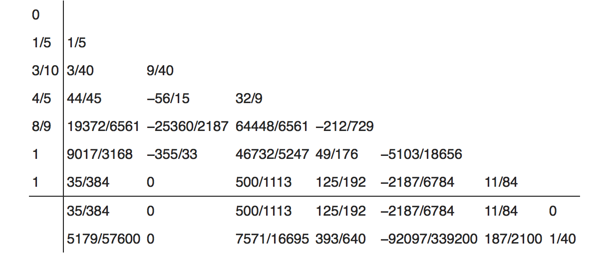

# Homework 7
### due until 16.12., 8:30

Consider a light body which is moving in the gravitational field of two heavy objects. The motion of the light object will not influence the heavy objects.
The heavy bodies with mass ratio  circle in the (x,y) plane with frequency 1 around their common center of gravity, which we assume to be the origin.

The equations of motion of the light body are

Consider the motion of a light body in the field of earth and moon. The mass ratio is . We restrict ourself to planar motion (z=0) and may use the initial conditions

This (according to literature) should lead to a periodic motion with period T=17.065216560157.
These orbits are known as Arenstorf orbits.

***
Implement the Dormand-Prince 4/5 RK method with the coefficients

to solve the ODEs. The first line of *b*-coefficients corresponds to the fifth-order result and the second line to the fourth-order result.

Use the norm , where , to implement a step-size control. Limit
 to reasonable numbers *Tol*, i.e. try values in the range of *Tol* = 1e-3 to *Tol* = 1e-10.
After adjusting the time step continue the integration using the result from the fourth-order scheme (Check for yourself whether it matters which solution you use to continue the integration).

For *Tol* = 1e-5 supply a plot for the trajectory (x(t),y(t)) and plot dt versus t to see how the algorithm adjusts the step-size.
